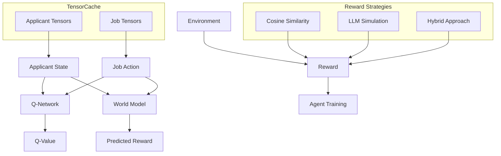
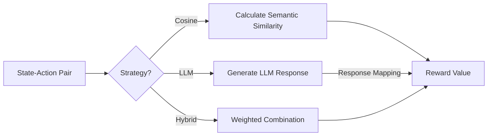

# Dyna-Q Job Recommender with LLM-Enhanced Training

A reinforcement learning system for personalized job recommendations using the Dyna-Q algorithm integrated with Large Language Models to simulate user feedback and mitigate the cold-start problem.

> **Try it now**: Run the project in our [Google Colab Notebook](https://colab.research.google.com/drive/1CPiFETwEc3kyjsFjuJpGbx7xJM8c6M1j?usp=sharing)

## 1. Overview

This project implements an advanced job recommendation system utilizing the Dyna-Q reinforcement learning (RL) algorithm. The system is designed to provide highly personalized job recommendations by training specialized agents for individual applicants. A key innovation is the integration of Large Language Models (LLMs) to simulate user feedback, thereby enriching the training data and addressing the critical **cold-start problem** often encountered in recommender systems.

### 1.1. Experimental Results

Our model demonstrates strong performance and training stability across multiple metrics:


*Q-Network training loss shows a clear convergence trend, indicating the model is effectively learning job-applicant preferences even within limited training iterations.*


*World Model loss demonstrates full convergence, validating the environment dynamics prediction capabilities critical for the planning phase of Dyna-Q.*

These results confirm the viability of our approach for personalized job recommendations, with both Q-Network and World Model components showing expected learning behavior. The downward trend in Q-Network loss suggests additional training would yield further improvements, while the fully converged World Model ensures reliable planning capabilities.

### 1.2. Objectives

- **Personalization**: Develop RL agents that learn the unique preferences of individual job applicants
- **Cold-Start Mitigation**: Employ pre-training and LLM-simulated interactions for effective recommendations with limited user data
- **Sample Efficiency**: Leverage the Dyna-Q architecture, combining model-free (direct RL) and model-based (planning) approaches
- **Comparative Analysis**: Evaluate different reward generation strategies (cosine similarity, LLM-simulated feedback, hybrid)

### 1.3. Key Innovations

- **Single-Applicant Specialization**: Each RL agent is trained exclusively for one target applicant
- **LLM-Powered Reward Simulation**: Uses LLMs to generate realistic feedback for richer training signals
- **TensorCache Implementation**: Efficient tensor storage and retrieval for optimized performance
- **Hybrid Reward Strategies**: Combines semantic similarity with LLM feedback using configurable weighting

For a complete training procedure walkthrough, see [Training Procedure Documentation](docs/training_procedure.md).

## 2. System Architecture

The system comprises neural networks integrated within a Dyna-Q framework:



### 2.1. Key Components

- **Q-Network**: Approximates $Q(s, a)$ - the expected reward for recommending job $a$ to applicant $s$
- **World Model**: Predicts rewards for planning steps, improving sample efficiency
- **TensorCache**: Efficiently stores and retrieves applicant/job embeddings with fast cosine similarity computation
- **Environment Classes**:
  - `JobRecommendationEnv`: Cosine similarity rewards
  - `LLMSimulatorEnv`: LLM-simulated feedback
  - `HybridEnv`: Weighted combination with configurable annealing

For detailed model architecture information, see [Models Technical Description](docs/models_technical_description.md).

## 3. Reinforcement Learning Formulation

Job recommendation is modeled as a Markov Decision Process (MDP):

- **State** ($s_t$): Applicant embedding vector (768-dimensional)
- **Action** ($a_t$): Job embedding vector (1536-dimensional)
- **Reward** ($R_{t+1}$): Strategy-dependent feedback signal
- **Transition**: $s_{t+1} = s_t$ (static applicant state)
- **Objective**: Learn optimal Q-function $Q^*(s,a)$ where:

$Q^*(s,a) = \mathbb{E} \left[R_{t+1}+\gamma\max_{a'}Q^*(s_{t+1}, a')|s_t=s,a_t=a\right]$

For a more detailed formulation, see [RL Formulation Documentation](docs/rl_formulation.md).

## 4. Reward Strategies

Three reward strategies are implemented, configurable at runtime:



1. **Cosine Similarity** (baseline):
   $$R_{\text{cosine}} = \frac{s_t \cdot a_t}{||s_t|| \cdot ||a_t||}$$

2. **LLM-Simulated Feedback**:
   - LLM evaluates applicant-job fit (APPLY/SAVE/IGNORE)
   - Response is mapped to numerical reward

3. **Hybrid Approach**:
   $$R_{\text{hybrid}} = w_{\text{cos}} \cdot R_{\text{cosine}} + (1-w_{\text{cos}}) \cdot R_{\text{LLM}}$$
   - Weight $w_{\text{cos}}$ can be annealed during training

For detailed implementation information, see [Reward Strategy Documentation](docs/reward_strategy.md).

## 5. TensorCache System

The TensorCache provides efficient storage and retrieval of tensor embeddings:

- **Fast tensor lookup** by ID or index
- **Efficient cosine similarity calculations** across all cached tensors
- **Reduced database load** by caching tensors in memory
- **Seamless integration** with reinforcement learning environments

```python
# TensorCache usage example
tensor_cache = TensorCache(device=device)
tensor_cache.copy_from_database(db_connector, applicant_ids)
state_tensor = tensor_cache.get_applicant_state(applicant_id)
action_tensor = tensor_cache.get_job_vector_by_index(job_idx)
similarities = tensor_cache.calculate_cosine_similarities(state_tensor)
```

## 6. Training Process

### 6.1. Pre-training

Initializes models to address the cold-start problem:

```bash
python src/main.py pretraining --strategy hybrid --num_epochs 20 \
  --save_path ./models/pretrained_hybrid_agent
```

### 6.2. Agent Training

```bash
python src/main.py train --applicant_id "applicant_xyz" \
  --strategy hybrid --pretrained_model_path ./models/pretrained_hybrid_agent \
  --num_episodes 100
```

### 6.3. Evaluation

```bash
python src/main.py evaluate --compare --baseline_path ./models/baseline \
  --pretrained_path ./models/pretrained --reward_strategy hybrid
```

For a comprehensive explanation of the training process, see [Training Technical Description](docs/training_technical_description.md).

For evaluation methodologies and metrics, see [Evaluation Technical Description](docs/evaluation_technical_description.md).

## 7. Project Structure

```
neural_model_repo/
├── config/               # Configuration files
├── docs/                 # Detailed documentation
├── src/
│   ├── data/             # Data handling and database interfaces
│   │   ├── tensor_cache.py  # Efficient tensor storage system
│   │   └── database.py      # MongoDB integration
│   ├── environments/     # Simulation environments
│   │   └── job_env.py    # JobRecommendationEnv, LLMSimulatorEnv, HybridEnv
│   ├── models/           # Neural network models
│   │   ├── q_network.py  # Q-value prediction network
│   │   └── world_model.py # Environment dynamics model
│   ├── training/         # Training utilities
│   │   └── agent.py      # DynaQAgent implementation
│   ├── utils/            # Utility functions
│   ├── main.py           # Unified command-line interface
│   ├── pretraining.py    # Pre-training scripts
│   ├── train.py          # Model training script
│   └── evaluate.py       # Evaluation scripts
├── neural_dyna_q_notebook.py  # Primary demonstration notebook
└── requirements.txt      # Project dependencies
```

## 8. Quick Start

### Option 1: Google Colab (Recommended)

The easiest way to run this project is through our prepared Google Colab notebook:

[](https://colab.research.google.com/drive/1CPiFETwEc3kyjsFjuJpGbx7xJM8c6M1j?usp=sharing)

This notebook includes all necessary setup steps and demonstrates the key functionalities of the system.

### Option 2: Local Installation

1. **Clone repository and install dependencies**:
   ```bash
   git clone https://github.com/yourusername/LLM-Planning-Recommendation-System.git
   cd LLM-Planning-Recommendation-System
   pip install -r requirements.txt
   ```

2. **Set up MongoDB and HuggingFace credentials**:
   ```bash
   export MONGODB_CONNECTION_STRING="mongodb+srv://..."
   export HUGGING_FACE_TOKEN="your_hf_token"
   ```

3. **Run pre-training**:
   ```bash
   python src/main.py pretraining --strategy cosine --num_epochs 50
   ```

4. **Train for a specific applicant**:
   ```bash
   python src/main.py train --applicant_id "applicant_xyz" --strategy hybrid
   ```

5. **Generate recommendations**:
   ```bash
   python src/main.py simulate --model_path ./models/applicant_xyz_agent \
     --applicant_id "applicant_xyz" --num_recommendations 5
   ```

For more information on the database structure used in this project, see [Database Structure Documentation](docs/database_structure.md).

## 9. Dependencies

- Python 3.8+
- PyTorch 2.0+
- Transformers (Hugging Face)
- MongoDB (pymongo)
- NumPy, Matplotlib, tqdm

## 10. Documentation

See the `docs/` directory for detailed documentation:
- [Reward Strategies](docs/reward_strategy.md)
- [RL Formulation](docs/rl_formulation.md)
- [Model Architecture](docs/models_technical_description.md)
- [Evaluation Methods](docs/evaluation_technical_description.md)
- [Training Process](docs/training_technical_description.md)
- [Database Structure](docs/database_structure.md)
- [Training Procedure](docs/training_procedure.md)

## License

MIT License

