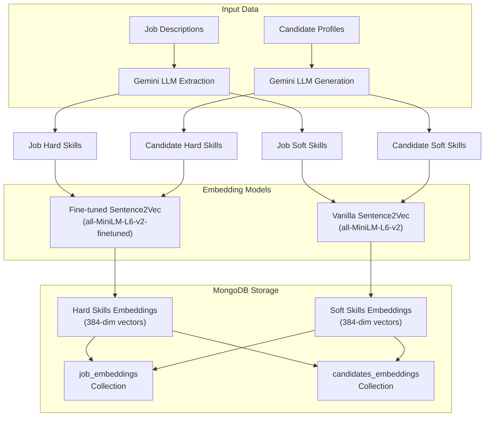
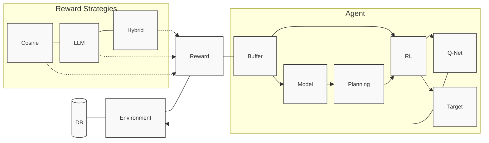
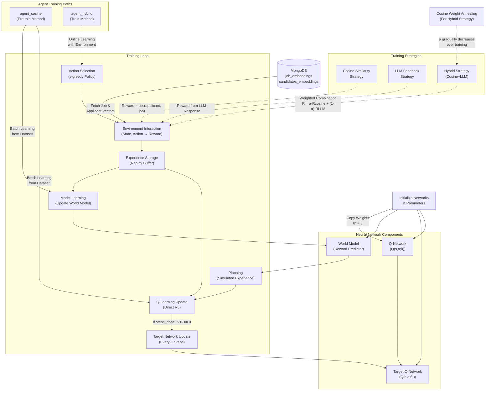
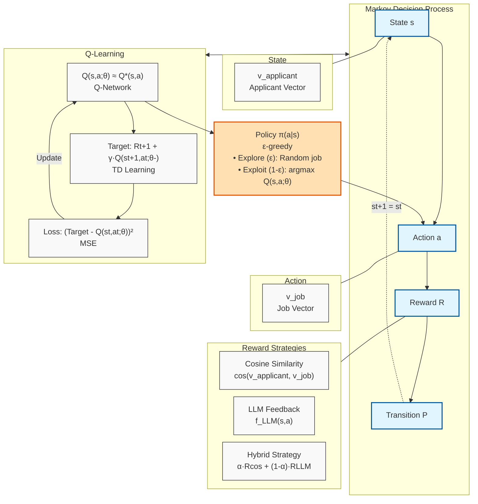

# Embedding Architecture Diagrams

## Option 1: Embedding Strategy Overview

# Training Process Diagrams

## Dyna-Q Training Workflow (Compact Version)

## Dyna-Q Training Workflow (Detailed)

# RL Formulation Diagram

## Job Recommendation MDP

